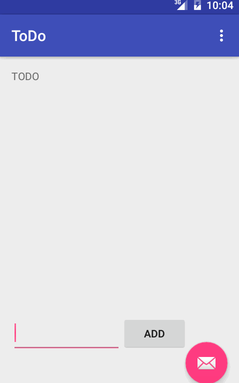

# ToDo list application demo

This is a demo project. The first successful ToDo list project aims at making sure we have a working dev environment.
The ToDo list keeps itemized list in storage. The app enables the user to create new items, remove existing ones and also modify.

Notes:
Time spent : 4 hours
Experimented with different emulators, different layouts.

